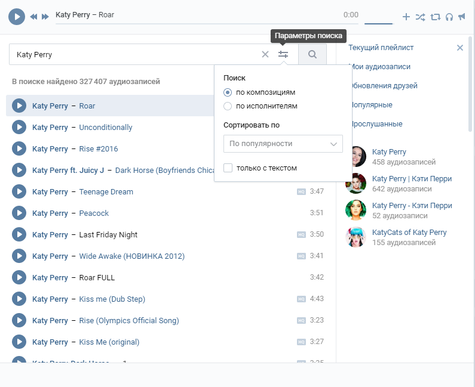
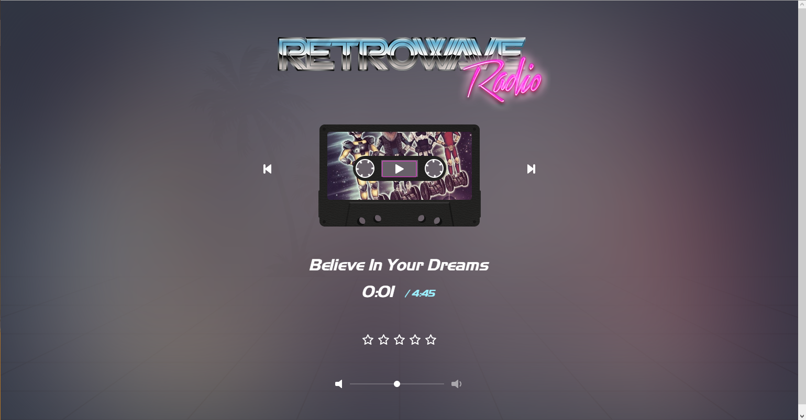

**студент группы ИПБ-13 Куликов Павел**

Итак, для рассмотрения удачных и неудачных интерфейсных решений я выбрал поиск и прослушивание музыки на сайтах music.yandex.ru и vk.com

У Яндекс.Музыка удачный интерфейс с богатым функционалом, позволяющий удобно искать и слушать музыку. На этом сайте есть группировка музыки по исполнителю. У каждого исполнителя имеется своя страничка с полным списком композиций и со списком альбомов (для прослушивания не сразу же всех композиций, а только конкретного альбома). На страничке можно узнать о похожих исполнителях. Также есть группировка музыки по жанрам. Пользователь может сохранять как отдельные композиции, так и альбомы, и просто понравившихся исполнителей. К тому же Яндекс делает ежедневные музыкальные подборки, благодаря которым пользователь может найти интересные композиции и познакомится с новыми исполнителями.

Основные преимущества Яндекс.Музыка:
+ группировка музыки по исполнителю или по жанрам;
+ прослушивание отдельного альбома;
+ сохранение композиций, альбомов или исполнителей;
+ поиск похожих исполнителей;
+ ежедневные музыкальные подборки.

У сайта vk.com неудачные интерфейсные решения для поиска и прослушивания музыки. Этот сайт не предоставляет многие из вышеописанных возможностей, остальные реализованы менее удобно для использования пользователями.
	

Также хочу рассказать о сайте retrowave.ru Многие сайты радио обладают перегруженными интерфейсами и дизайнами, к тому же неудачно показывается реклама. А у сайта retrowave.ru лаконичный интерфейс и приятный дизайн, подходящий контексту.
	

